# Evaluation and Governance Pipeline (Diagram View)

```mermaid
flowchart LR
  A["Pre-Execution Gate<br/>AuthZ + policy + input safety checks"]
  B["Model Generation<br/>Approved adapter + traceability"]
  C["Scoring & Trust Card Build<br/>Metrics + stage gates + trust decision"]
  D["Release Output Package<br/>Model output + attached scorecard"]

  A --> B --> C --> D

  subgraph T["Trust Signals (Measure)"]
    T1["Accuracy"]
    T2["Reliability"]
    T3["Robustness"]
    T4["Fairness"]
    T5["Safety Signals"]
    T6["Evidence Completeness"]
  end

  T --> C

  subgraph G["Governance Controls (Manage)"]
    G1["Policy & Risk Controls"]
    G2["Evaluation Controls"]
    G3["Security Controls"]
    G4["Documentation Controls"]
    G5["Operational Controls"]
  end

  G --> C

  C --> E{"Stage Gate Result"}
  E -->|"All pass"| F["GO"]
  E -->|"Any needs_review"| H["NO-GO (Pending Human Review)"]
  E -->|"Any fail"| I["NO-GO (Block Release)"]

  F --> D
  D --> J["Monitor + Continuous Improvement"]
  H --> J
  I --> J

  classDef stage fill:#e6f0ff,stroke:#2a5bd7,stroke-width:1.5px,color:#1a2950;
  classDef signal fill:#e9f9ef,stroke:#1f8a4c,stroke-width:1.5px,color:#114d2a;
  classDef control fill:#fff2db,stroke:#b87200,stroke-width:1.5px,color:#5c3c00;
  classDef decision fill:#f2ecff,stroke:#5f3dc4,stroke-width:1.5px,color:#35206a;
  classDef go fill:#dcfce7,stroke:#15803d,stroke-width:1.5px,color:#14532d;
  classDef nogo fill:#fee2e2,stroke:#b91c1c,stroke-width:1.5px,color:#7f1d1d;
  classDef loop fill:#ecfeff,stroke:#0e7490,stroke-width:1.5px,color:#083344;

  class A,B,C,D stage;
  class T1,T2,T3,T4,T5,T6 signal;
  class G1,G2,G3,G4,G5 control;
  class E decision;
  class F go;
  class H,I nogo;
  class J loop;
```

## High Notes
- This pipeline aligns evaluation work to **NIST Measure** and release decisions to **NIST Manage**.
- Trust is established through six signal families: accuracy, reliability, robustness, fairness, safety, and evidence completeness.
- Governance is enforced through stage gates: any `fail` blocks release; any `needs_review` requires human approval.
- Scorecard is computed before release and attached to the final output package.
- The process is designed for offline development now and production-hardening later.
